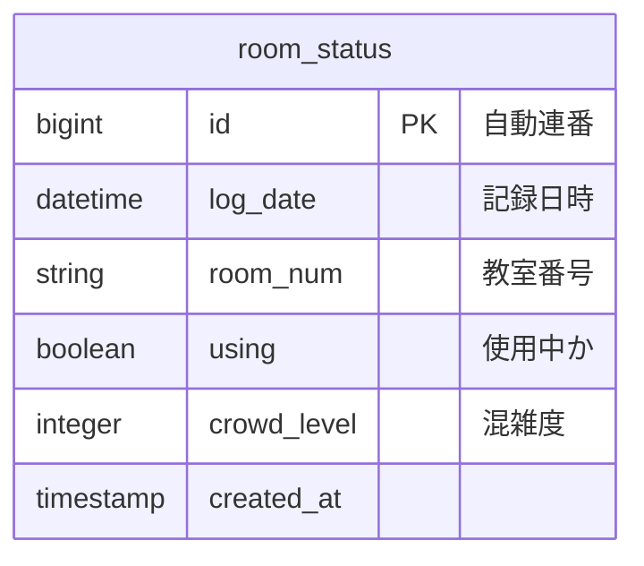

```mermaid
erDiagram
  room_status {
    bigint id PK "自動連番"
    datetime log_date "記録日時"
    string room_num "教室番号"
    boolean using "使用中か"
    integer crowd_level "混雑度"
    timestamp created_at
  }
```